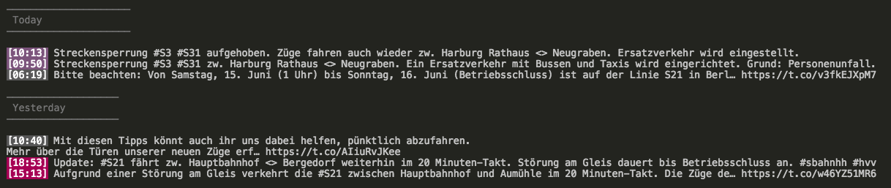

## SBAHNHAMBURG-TWITTER-CLI

With this tool you can fetch the latest tweets from [SBahnHamburg](https://twitter.com/SBahnHamburg) directly from a CLI. You can also filter the tweets by the SBahn lines mentionned.

### Installation

##### Build from source

Prerequisites

- Node.js v.10.10 recommended (> v.8 should work as well)

- Yarn

- Twitter Access Token/Secret

- Twitter Consumer Key/Secret

Create a file called `config.json` and paste the content of `config.template.json` into it. Insert all your Twitter tokens/secrets/keys and configure as needed.

After that, run the following command: `yarn && yarn build`. This will install all dependencies and build the bundled file in the `dist` directory.

### Usage

If you want to fetch information about the default lines provided in `config.json`, run `node dist/sbahnhamburg-twitter-cli.js`.

If you want to fetch information about specific lines regardless of your default lines, provide `s 2 3 31` as argument to retrieve information about the lines `2`, `3`, and `31`. For instance: `node dist/sbahnhamburg-twitter-cli.js s 2 3 31`.

If you want to fetch _all_ tweets regardless of your default lines or whether those tweets contain information about any lines, provide `-a` or `--all` as argument. For instance: `node dist/sbahnhamburg-twitter-cli.js -a`.

### Example

The background color of the tweet's time indicates the SBahn line which was tweeted about. If no line could be inferred from the tweet's hashtags, the background color will default to grey.
